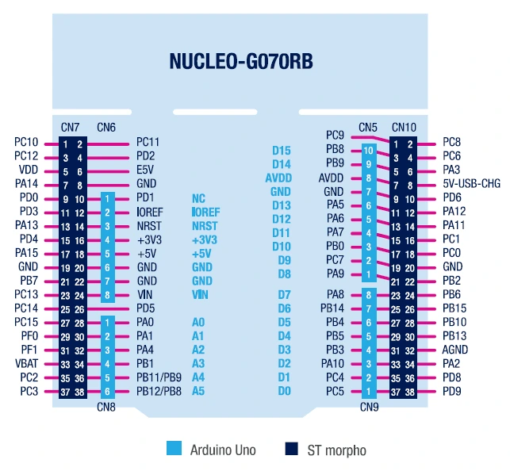
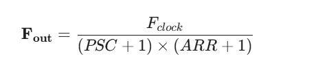
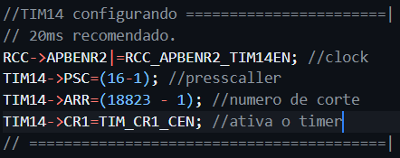

<h1>Lógica de Contagem com botões, Detecção de Borda e Debounce</h1>
<h3>Exercício 3 : Subindo e descendo</h3>

Acrescente 2 botões ao kit. Ao pressionar um dos botões, a contagem é
incrementada, ao pressionar o outro botão, a contagem é decrementada.
Quando a contagem atingir um dos extremos, (0 ou 9), a contagem fica
limitada neste valor e o led correspondente ao ponto deve ser acionado,
indicando um estouro.

<h3>ARM usado STM32G0B1</h3>

<h3>Montagem</h3>

Para montagem usaremos 2 botões push configurados em pull-down, 1 led ativo em Alto e um display de 7 segmentos cátodo comum.

<h3>Determinar Frequência de Saída</h3>

Neste Exemplo vamos calcular para que a Frêquencia do periférico TIM14 seja tal que os eventos ocorram em intervalos de 20ms
para que a leitura efetue o Debounce. A ideia é que a leitura do pino ocorra em intervalos que não detectem os picos indesejados da trepidação do botão(Bounce) efetuando assim o Debounce.

<h3>Bounce x Debounce por software</h3>

<h4> Calculando a Frequência do TIM14</h4>

T=20ms, F=?, F=1/20ms, F=50Hz 

Para fins de praticidade assumimos um PSC de 16 para que o clock seja dividido e fique 1MHz.

 
<h3>Codigo Linha 10 e 14</h3>

