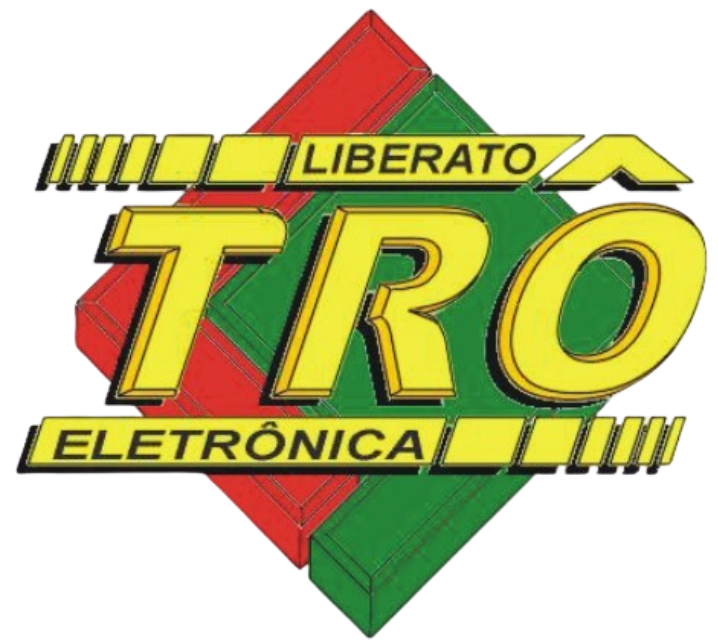

<h2> Microprocessados</h2>

<h3> Davi Sant`Anna </h3>
Este repositório tem como propósito guardar e expor trabalhos feitos na matéria de microprocessados do professor Marcos Zuccolotto da Escola Fundação Escola Técnica Liberato Salzano Vieira da Cunha.
<a src="">Matriz led 5x7</a>
