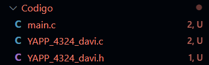
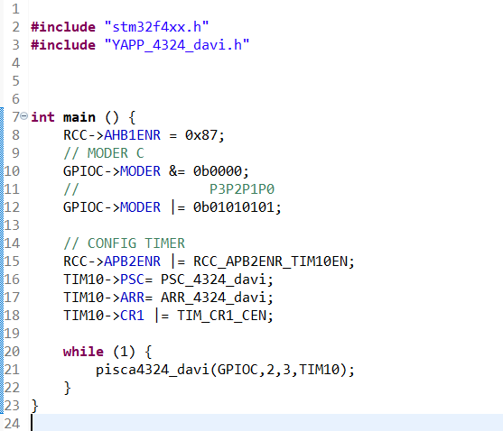

<h1 align="center">Pisca Led com Periférico TIM</h1>

Neste trabalhos devemos fazer um codigo para piscar um conjunto de leds, porém o trabalho deve ter dinamico podendo trocar os pinos, GPIOS e TIM direto por uma função sem alteração no codigo da lógica de piscada do led.
 
//                 GPIO  PinA PinB e TIMER usado.
 
Exemplo: PiscaLeds(GPIOA, 0, 1, TIM10);

  <video width="300" controls autoplay muted loop>
    <source src="video/LEDV.mp4" type="video/mp4">
    Seu navegador não suporta a tag de vídeo.
  </video>

<h2>Codigo e Formato</h2>

Para começar então criamos 2 arquivos separados, .c e .h, estes serão a nossa biblioteca que terá a função criada para apenas implementar e poder alterar os perifericos usados. Como se vê aqui:

 
<a href="Codigo/">Aperte aqui para ter acesso ao codigo</a>

